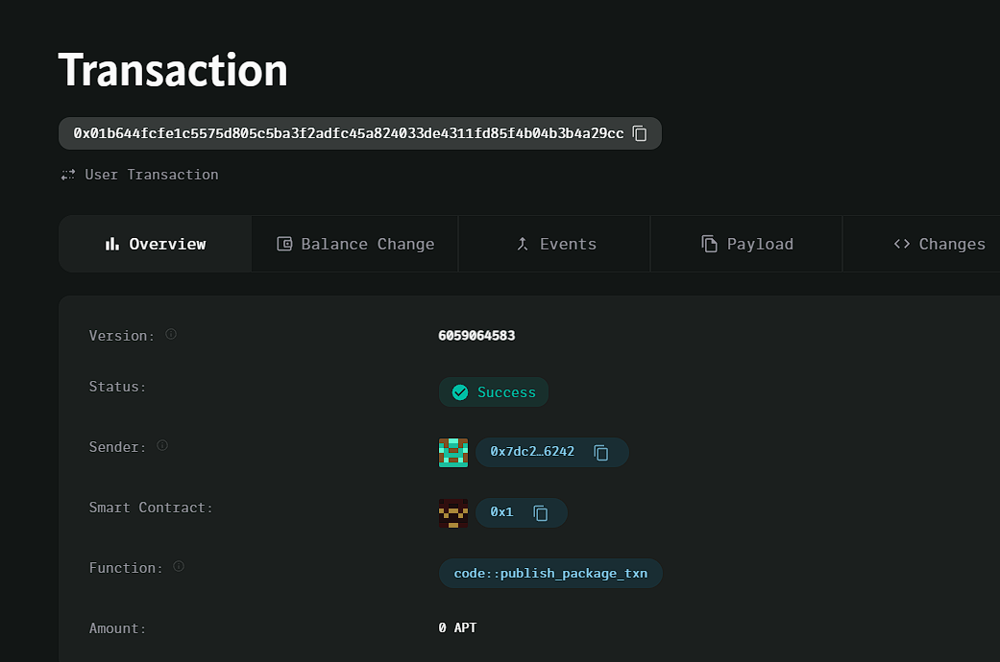

### Deployed smartcontract address: 0x01b644fcfe1c5575d805c5ba3f2adfc45a824033de4311fd85f4b04b3b4a29cc

### Screenshot: 

# Subscription Service

## Project Title
Decentralized Subscription Service

## Project Description
A decentralized subscription system where users can subscribe to a service and make recurring payments using cryptocurrency.

## Vision
Our vision is to provide a transparent and secure subscription platform where payments are automatically managed using blockchain technology, ensuring trust between subscribers and service providers.

## Key Features
- Users can subscribe to services by setting a payment amount and a payment cycle.
- Service providers automatically receive payments at the end of each subscription cycle.
- The system ensures that payments are transparent, secure, and tamper-proof.

## Future Scope
- Add support for multiple cryptocurrencies.
- Enable subscription cancellation and refund options.
- Implement flexible payment cycles (e.g., weekly, yearly).
- Develop an interface for service providers to manage their subscription services.

